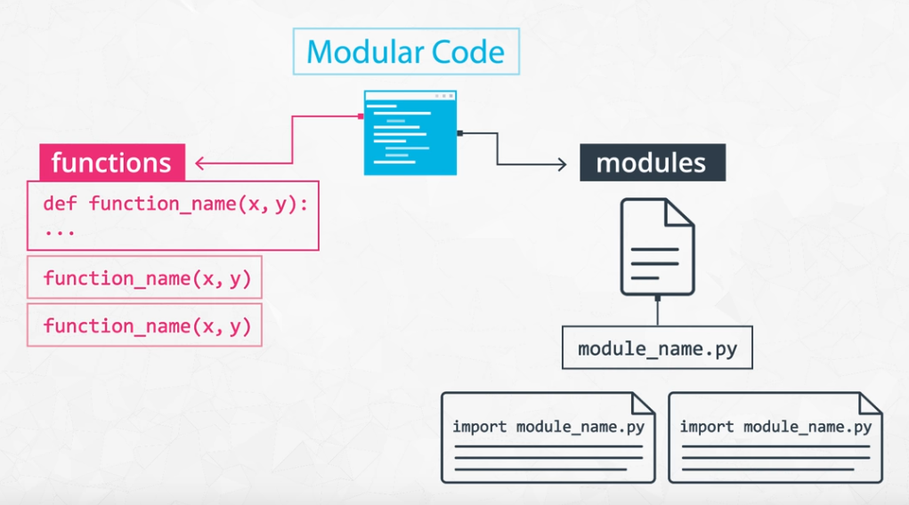

# Software Engineering Practices 

 This Repo is about the following practices of software engineering and how they apply in data science.

<b>
 
1.	Writing clean 
 
2.	Writing modular code

3.	Writing efficient code

4.	Code refactoring

5.	Adding meaningful documentation

6.	Using version control

7.	Testing

8.	Logging

9.	Code reviews
</b>

# 1.	Clean Code

The first practice I'll talk about is writing code in a way that is clean and modular. When you're working in industry, your code could potentially be used in production. Production code just means, code that is run on production servers. For example, when you're on your laptop using software products like Google, or Amazon, the code that's running the service you're using is production code. 

Ideally, code that's being used in production should meet a number of criteria to ensure reliability and efficiency before it becomes public. 

**CLEAN means** readable, simple, and concise. A characteristic of production quality code that is crucial for collaboration and maintainability in software development. 

### Writing Clean Code: Meaningful Names

**Tip: Use meaningful names**
* Be descriptive and imply type - E.g. for booleans, you can prefix with is_ or has_ to make it clear it is a condition. You can also use part of speech to imply types, like verbs for functions and nouns for variables.

* Be consistent but clearly differentiate - E.g. age_list and age is easier to differentiate than ages and age. 
* Avoid abbreviations and especially single letters - (Exception: counters and common math variables) Choosing when these exceptions can be determined based on the audience for your code. If you work with other data scientists, certain variables may be common knowledge. While if you work with full stack engineers, it might be necessary to provide more descriptive names in these cases as well. 
* Long names != descriptive names - You should be descriptive, but only with relevant information. E.g. good functions names describe what they do well without including details about implementation or highly specific uses.

Try testing how effective your names are by asking a fellow programmer to guess the purpose of a function or variable based on its name, without looking at your code. Coming up with meaningful names often requires effort to get right.

### Writing Clean Code: Nice Whitespace

**Tip: Use whitespace properly**

* Organize your code with consistent indentation - the standard is to use 4 spaces for each indent. You can make this a default in your text editor.
* Separate sections with blank lines to keep your code well organized and readable.
* Try to limit your lines to around 79 characters, which is the guideline given in the PEP 8 style guide. In many good text editors, there is a setting to display a subtle line that indicates where the 79 character limit is. 

For more guidelines, check out [the code layout section of PEP 8](https://www.python.org/dev/peps/pep-0008/?#code-lay-out).

# 2.	Modular Code

**MODULAR:** logically broken up into functions and modules. An important characteristic of production quality code that makes your code more organized, efficient, and reusable. Modularizing your code or breaking up your code into logical functions and modules really helps you organize your program in cleaner and more efficient.

 
 **MODULE** is a file. Modules allow code to be reused by encapsulating them into files that can be imported into other files.

### Writing Modular Code 
**Tip: DRY (Don't Repeat Yourself)**

Don't repeat yourself! Modularization allows you to reuse parts of your code. Generalize and consolidate repeated code in functions or loops.

**Tip: Abstract out logic to improve readability**

Abstracting out code into a function not only makes it less repetitive, but also improves readability with descriptive function names. Although your code can become more readable when you abstract out logic into functions, it is possible to over-engineer this and have too many modules, so use your judgement. 

**Tip: Minimize the number of entities (functions, classes, modules, etc.)**

There are tradeoffs to having function calls instead of inline logic. If you have broken up your code into an unnecessary amount of functions and modules, you'll have to jump around everywhere if you want to view the implementation details for something that may be too small to be worth it. Creating more modules doesn't necessarily result in effective modularization. 

**Tip: Functions should do one thing**

Each function you write should be focused on doing one thing. If a function is doing multiple things, it becomes more difficult to generalize and reuse. Generally, if there's an "and" in your function name, consider refactoring.

**Tip: Arbitrary variable names can be more effective in certain functions**

Arbitrary variable names in general functions can actually make the code more readable. 

**Tip: Try to use fewer than three arguments per function**

Try to use no more than three arguments when possible. This is not a hard rule and there are times it is more appropriate to use many parameters. But in many cases, it's more effective to use fewer arguments. Remember we are modularizing to simplify our code and make it more efficient to work with. If your function has a lot of parameters, you may want to rethink how you are splitting this up.

# 3.	Refactoring Code

REFACTORING means restructuring your code to improve its internal structure, without changing its external functionality. This gives you a chance to clean and modularize your program after you've got it working.

* Since it isn't easy to write your best code while you're still trying to just get it working, allocating time to do this is essential to producing high quality code. Despite the initial time and effort required, this really pays off by speeding up your development time in the long run.
* You become a much stronger programmer when you're constantly looking to improve your code. The more you refactor, the easier it will be to structure and write good code the first time.

To exercise refactoring check this [notebook](https://github.com/A2Amir/Software-Engineering-Practices-/blob/master/Code/refactor_wine_quality.ipynb).

# 4.	Efficient Code

Knowing how to write code that runs efficiently is another essential skill in software development. Optimizing code to be more efficient can mean making it:

* Execute faster
* Take up less space in memory/storage

The project you're working on would determine which of these is more important to optimize for your company or product. When we are performing lots of different transformations on large amounts of data, this can make orders of magnitudes of difference in performance.
To see a few examples of inefficient code, and practice refactoring to optimize their performance check these exercises below.

* [Optimizing - Common Books](https://github.com/A2Amir/Software-Engineering-Practices-/blob/master/Code/optimizing_code_common_books%20.ipynb)
* [Optimizing - Holiday Gifts](https://github.com/A2Amir/Software-Engineering-Practices-/blob/master/Code/optimizing_code_holiday_gifts.ipynb)

# 5.	Documentation

DOCUMENTATION is additional text or illustrated information that comes with or is embedded in the code of software. It is helpful for clarifying complex parts of code, making your code easier to navigate, and quickly conveying how and why different components of your program are used.

Several types of documentation can be added at different levels of your program:

* In-line Comments - line level
*	Docstrings - module and function level
* Project Documentation - project level

### In-line Comments

In-line comments are text following hash symbols throughout your code. They are used to explain parts of your code, and really help future contributors understand your work.

*	One way comments are used is to document the major steps of complex code to help readers follow. Then, you may not have to understand the code to follow what it does. However, others would argue that this is using comments to justify bad code, and that if code requires comments to follow, it is a sign refactoring is needed.
     
                                        c=a+b # adding two variables (In-line Comment)
                                      
* Comments are valuable for explaining where code cannot. For example, the history behind why a certain method was implemented a specific way. Sometimes an unconventional or seemingly arbitrary approach may be applied because of some obscure external variable causing side effects. These things are difficult to explain with code.

### Docstrings

Docstring, or documentation strings, are valuable pieces of documentation that explain the functionality of any function or module in your code. Ideally, each of your functions should always have a docstring. 
Docstrings are surrounded by triple quotes. The first line of the docstring is a brief explanation of the function's purpose (see example below). 
The next element of a docstring is an explanation of the function's arguments. you list the arguments, state their purpose, and state what types the arguments should be. Finally it is common to provide some description of the output of the function. Every piece of the docstring is optional; however, doc strings are a part of good coding practice.

~~~python

def population_density(population, land_area):
    """Calculate the population density of an area.

    Args:
    population: int. The population of the area
    land_area: int or float. This function is unit-agnostic, if you pass in values
    in terms of square km or square miles the function will return a density in those units.

    Returns:
    population_density: population/land_area. The population density of a 
    particular area.
    """
    return population / land_area

~~~
Check these links to get more information:
*	[PEP 257 - Docstring Conventions](https://www.python.org/dev/peps/pep-0257/) 
* [NumPy Docstring Guide](https://numpydoc.readthedocs.io/en/latest/format.html)

### Project Documentation

Project documentation is essential for getting others to understand why and how your code is relevant to them, whether they are potentials users of your project or developers who may contribute to your code. A great first step in project documentation is your README file. It will often be the first interaction most users will have with your project. Whether it's an application or a package, your project should absolutely come with a README file. At a minimum, this should explain what it does, list its dependencies, and provide sufficiently detailed instructions on how to use it. You want to make it as simple as possible for others to understand the purpose of your project, and quickly get something working.

Translating all your ideas and thoughts formally on paper can be a little difficult, but you'll get better over time and makes a significant difference in helping others realize the value of your project. Writing this documentation can also help you improve the design of your code, as you're forced to think through your design decisions more thoroughly. This also allows future contributors to know how to follow your original intentions.

Here are a few READMEs from some popular projects:

* [Bootstrap](https://github.com/twbs/bootstrap)
* [Scikit-learn](https://github.com/scikit-learn/scikit-learn)
* [Stack Overflow Blog](https://github.com/jjrunner/stackoverflow)

# 6.	Version Control in Data Science

you might already know a bit about version control. But if you don't, a handy trick I've learned is to try reading the words in reverse - so "version control" would become "control version"! So a Version Control System is just software that helps you control (or manage) the different versions...of something.

There are [a number of Version Control Systems](https://en.wikipedia.org/wiki/List_of_version_control_software). This alone should prove that version control is incredibly important. Three of the most popular version control systems are:
•	[Git](https://git-scm.com/)
•	[Subversion](https://subversion.apache.org/)
•	[Mercurial](https://www.mercurial-scm.org/)

There are two main types of version control system models:

*	the centralized model - all users connect to a central, master repository
*	the distributed model - each user has the entire repository on their computer

the main point of a version control system is to help you maintain a detailed history of the project as well as the ability to work on different versions of it. Having a detailed history of a project is important because it lets you see the progress of the project over time. If needed, you can also jump back to any point in the project to recover data or files.

Using commands(like below) in Git is a few ways of version control that can be used in data science on a team.

* git commit: To commit messages
* git checkout:To switch branches
* git pull: to pull changes
* git merge: to megre branches
* git push: to push changes up

There's a great article on a successful git branching strategy that you should really read [here](http://nvie.com/posts/a-successful-git-branching-model/). Version control in data science can be tricky, because there are many pieces involved that can be hard to track, such as large amounts of data, model versions, seeds, hyperparameters, etc.

Here are some resources for useful ways and tools for managing versions of models and large data. These are here for you to explore

* [How to Version Control Your Production Machine Learning Models](https://blog.algorithmia.com/how-to-version-control-your-production-machine-learning-models/)
* [Versioning Data Science](https://shuaiw.github.io/2017/07/30/versioning-data-science.html)

# 7.	Testing

Testing your code is essential before deployment. It helps you catch errors and faulty conclusions before they make any major impact. Today, employers are looking for data scientists with the skills to properly prepare their code for an industry setting, which includes testing their code.

Problems that could occur in data science aren’t always easily detectable; you might have values being encoded incorrectly, features being used inappropriately, unexpected data breaking assumptions.

To catch these errors, you have to check for the quality and accuracy of your analysis in addition to the quality of your code. Proper testing is necessary to avoid unexpected surprises and have confidence in your results. There are two types of test

*	TEST DRIVEN DEVELOPMENT: a development process where you write tests for tasks before you even write the code to implement those tasks.
*	UNIT TEST: a type of test that covers a “unit” of code, usually a single function, independently from the rest of the program.

### Resources:
* Four Ways Data Science Goes Wrong and How Test Driven Data Analysis Can Help: [Blog Post](https://www.predictiveanalyticsworld.com/machinelearningtimes/four-ways-data-science-goes-wrong-and-how-test-driven-data-analysis-can-help/6947/)
* Ned Batchelder: Getting Started Testing: [Slide Deck](https://speakerdeck.com/pycon2014/getting-started-testing-by-ned-batchelder) and [Presentation Video](https://www.youtube.com/watch?v=FxSsnHeWQBY)

### Unit Tests

We want to test our functions in a way that is repeatable and automated. Ideally, we'd run a test program that runs all our unit tests and cleanly lets us know which ones failed and which ones succeeded. Fortunately, there are great tools available in Python that we can use to create effective unit tests!

#### Unit Testing Tools

To install pytest, run **pip install -U pytest** in your terminal. You can see more information on getting started [here](https://docs.pytest.org/en/latest/getting-started.html).
* Create a test file starting with test_
* Define unit test functions that start with test_ inside the test file
* Enter **pytest** into your terminal in the directory of your test file and it will detect these tests for you!

test_ is the default - if you wish to change this, you can learn how to in this [pytest configuration](https://docs.pytest.org/en/latest/customize.html)
In the test output (for example ..F..) , periods represent successful unit tests and F's represent failed unit tests. Since all you see is what test functions failed, it's wise to have only one assert statement per test. Otherwise, you wouldn't know exactly how many tests failed, and which tests failed.

Your tests won't be stopped by failed assert statements, but it will stop if you have syntax errors.check this [exercise](https://github.com/A2Amir/Software-Engineering-Practices-in-data-science./blob/master/Code/test_compute_launch.ipynb) to get more familiar.

#### Unit Test Advantages and Disadvantages

The advantage of unit tests is that they are isolated from the rest of your program, and thus, no dependencies are involved. They don't require access to databases, APIs, or other external sources of information. However, passing unit tests isn’t always enough to prove that our program is working successfully. To show that all the parts of our program work with each other properly, communicating and transferring data between them correctly, we use integration tests. In this Repo, I'll focus on unit tests; however, when you start building larger programs, you will want to use integration tests as well. 

You can read about integration testing and how integration tests relate to unit tests [here](https://www.fullstackpython.com/integration-testing.html). That article contains other very useful links as well.

### Test Driven Development and Data Science

TEST DRIVEN DEVELOPMENT means writing tests before you write the code that’s being tested. Your test would fail at first, and you’ll know you’ve finished implementing a task when this test passes.

* Tests can check for all the different scenarios and edge cases you can think of, before even starting to write your function. This way, when you do start implementing your function, you can run this test to get immediate feedback on whether it works or not in all the ways you can think of, as you tweak your function. 

* When refactoring or adding to your code, tests help you assured that the rest of your code didn't break while you were making those changes. Tests also helps ensure that your function behavior is repeatable, regardless of external parameters, such as hardware and time.

Test driven development for data science is relatively new and has a lot of experimentation and breakthroughs appearing, which you can learn more about in the resources below.

* [Data Science TDD](https://www.linkedin.com/pulse/data-science-test-driven-development-sam-savage/)
* [TDD for Data Science](http://engineering.pivotal.io/post/test-driven-development-for-data-science/)
* [TDD is Essential for Good Data Science Here's Why](https://medium.com/@karijdempsey/test-driven-development-is-essential-for-good-data-science-heres-why-db7975a03a44)
* [Testing Your Code](http://docs.python-guide.org/en/latest/writing/tests/) 

# 8.	Logging

Logging is valuable for understanding the events that occur while running your program. For example, if you run your model over night and see that it's producing ridiculous results the next day, log messages can really help you understand more about the context in which this occurred. Lets learn about the qualities that make a log message effective.

Logging is the process of recording messages to describe events that have occurred while running your software. Let's take a look at a few examples, and learn tips for writing good log messages.

**Tip: Be professional and clear**

    Bad: Hmmm... this isn't working???
    Bad: idk.... :(
    Good: Couldn't parse file

**Tip: Be concise and use normal capitalization**

    Bad: Start Product Recommendation Process
    Bad: We have completed the steps necessary and will now proceed with the recommendation process for the records in our product database.
    Good: Generating product recommendations.
    
**Tip: Choose the appropriate level for logging**

DEBUG - level you would use for anything that happens in the program.
ERROR - level to record any error that occurs
INFO - level to record all actions that are user-driven or system specific, such as regularly scheduled operations

~~~ python

import logging
logging.basicConfig(filename='example.log',level=logging.DEBUG)
logging.debug('This message should go to the log file')
logging.info('So should this')
logging.warning('And this, too')
~~~
or
~~~python
import logging

name = 'John'

logging.error('%s raised an error', name)
~~~

**Tip: Provide any useful information** 

    Bad: Failed to read location data
    Good: Failed to read location data: store_id 832497

# 9. Code Reviews

Code reviews benefit everyone in a team to promote best programming practices and prepare code for production. Let's go over what to look for in a code review and some tips on how to conduct one.

* [Code Review](https://github.com/lyst/MakingLyst/tree/master/code-reviews)
* [Code Review Best Practices](https://www.kevinlondon.com/2015/05/05/code-review-best-practices.html)

### Questions to Ask Yourself When Conducting a Code Review

First, let's look over some of the questions we may ask ourselves while reviewing code. These are simply from the concepts I've covered in this Repo!

**Is the code clean and modular?**
* Can I understand the code easily?
* Does it use meaningful names and whitespace?
* Is there duplicated code?
* Can you provide another layer of abstraction?
* Is each function and module necessary?
* Is each function or module too long?

**Is the code efficient?**
*	Are there loops or other steps we can vectorize?
*	Can we use better data structures to optimize any steps?
*	Can we shorten the number of calculations needed for any steps?
*	Can we use generators or multiprocessing to optimize any steps?

**Is documentation effective?**
*	Are in-line comments concise and meaningful?
*	Is there complex code that's missing documentation?
*	Do function use effective docstrings?
*	Is the necessary project documentation provided?

**Is the code well tested?**
*	Does the code high test coverage?
*	Do tests check for interesting cases?
*	Are the tests readable?
*	Can the tests be made more efficient?

**Is the logging effective?**
*	Are log messages clear, concise, and professional?
*	Do they include all relevant and useful information?
*	Do they use the appropriate logging level?

